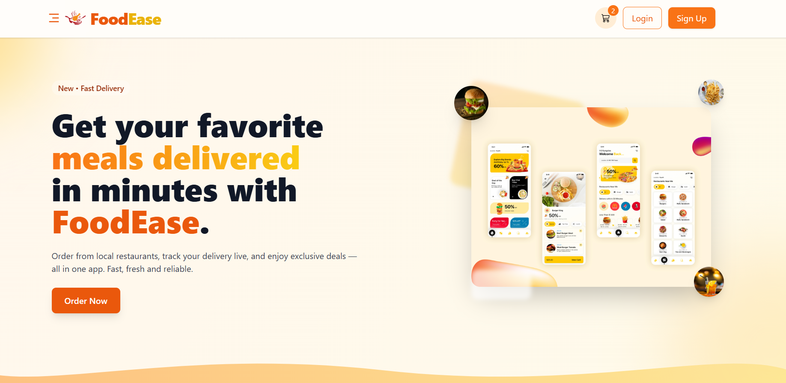
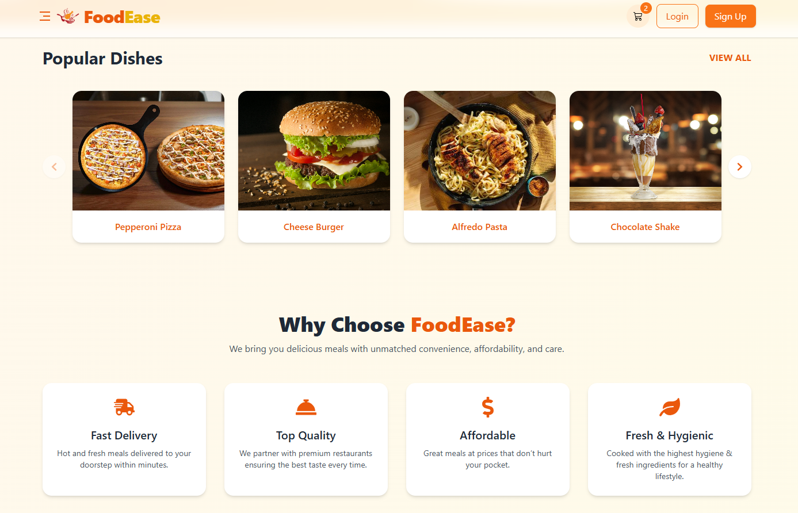
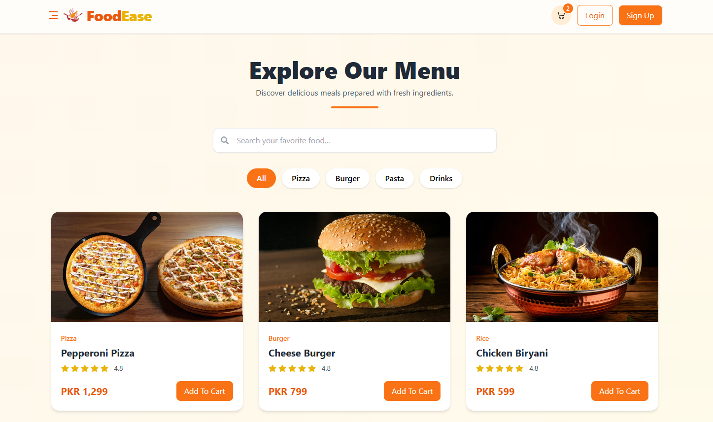

# 🍔 FoodEase

A modern and responsive food delivery website built with **React.js** and **Tailwind CSS**.

FoodEase is designed to provide users with a clean and engaging interface for exploring food delivery services, viewing features, checking pricing, and discovering available options through a user-friendly experience.

This project was created as a **frontend UI project** to demonstrate responsive design, reusable React components, modern layouts, and frontend development skills.

## 🚀 Tech Stack

* React.js
* JavaScript
* Tailwind CSS
* HTML5
* CSS3
* Vite
* React Icons

## ✨ Features

* Responsive food delivery website
* Modern and clean UI
* Hero section
* Features section
* Pricing section
* Contact section
* Responsive navigation
* Mobile-friendly layout
* Reusable React components
* Responsive design for desktop, tablet, and mobile

## 📂 Main Sections

### 1. Home

A modern landing section introducing FoodEase and its food delivery service.

**Features:**

* Hero section
* Call-to-action buttons
* Responsive layout
* Modern food delivery UI

---

### 2. Features

A dedicated section highlighting the main benefits and services offered by FoodEase.

**Features:**

* Service highlights
* Clean feature cards
* Responsive design
* User-friendly presentation

---

### 3. Pricing

A pricing section presenting different food delivery service plans in a clean and organized layout.

**Features:**

* Pricing cards
* Plan details
* Responsive layout
* Clear call-to-action elements

---

### 4. Contact

A contact section providing demo business contact information.

**Note:** The contact details displayed on this project are fictional and are used for demonstration purposes only.

---

## 📸 Screenshots

### Home



### Features



### Pricing



## 🛠️ Getting Started

Clone the repository:

```bash
git clone <your-github-repository-url>
```

Navigate to the project:

```bash
cd FoodEase
```

Install dependencies:

```bash
npm install
```

Start the development server:

```bash
npm run dev
```

The project will then be available on the local development server.

## 👩‍💻 About Me

I'm a **Frontend UI Developer** focused on creating modern, responsive, and user-friendly web interfaces using React.js and Tailwind CSS.

I enjoy turning ideas and designs into clean, functional, and responsive web experiences.

## 📬 Contact

**Email:** [mehreenkhurshid8@gmail.com](mailto:mehreenkhurshid8@gmail.com)

**GitHub:** https://github.com/mehreenkhurshid/foodease

**LinkedIn:** https://www.linkedin.com/in/mehreen-khurshid-9023562b6

## 📌 Project Status

FoodEase is a **frontend-focused demo project** created to showcase React.js UI development, responsive design, reusable components, and modern frontend development practices.

---

⭐ Feel free to explore the repository and check out my projects.
